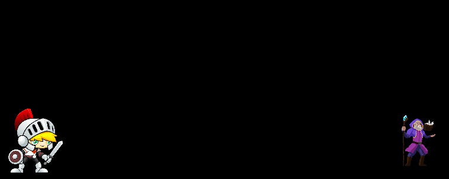
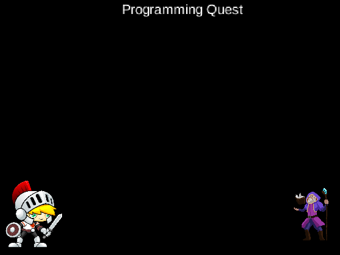
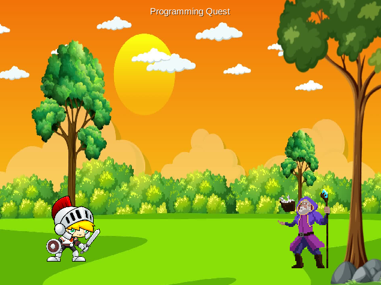
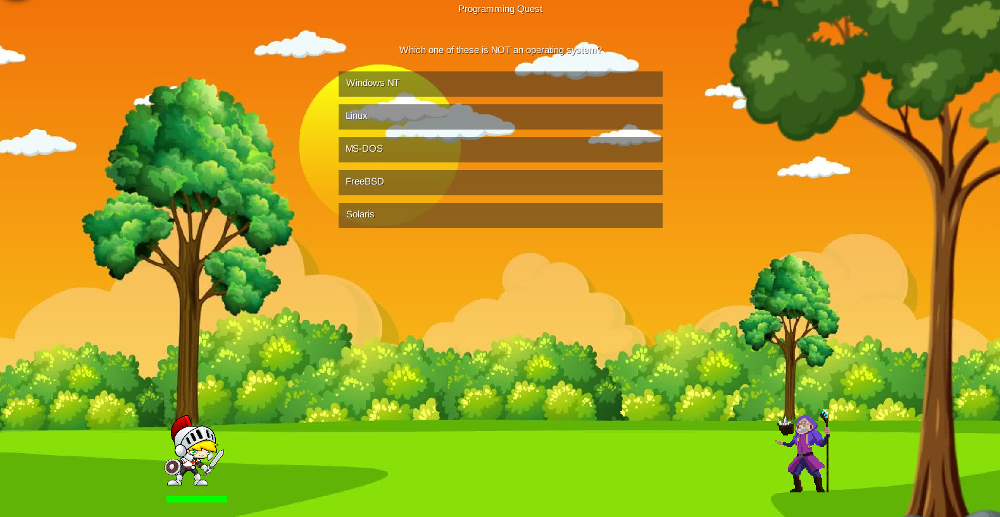
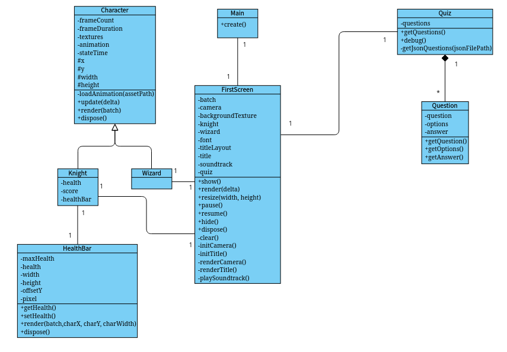

# Identificação 🪪:
Adrian, Sistemas de Informação

# Proposta 📄:
Este é um jogo web/desktop feito na biblioteca LibGDX em Java.
Se trata de um quiz com perguntas relacionadas a temas de computação. <br>
Para cada questão errada, o jogador perde dois de vida, e para cada certa, recupera um de vida. <br>
Se chegar ao final sem morrer, vence o jogo, e o inimigo, que faz as perguntas, é derrotado. <br>
O objetivo do projeto é criar uma forma divertida de praticar conhecimentos de programação.

# Processo de desenvolvimento 🛠️:
## Diário:
### 31/10:
Comecei implementando o personagem principal. Criei a classe Knight, que é um cavaleiro
desenhado com um animation sprite. <br>
Baixei as imagens do site gameart2d.com. <br>
Depois, troquei o nome da classe Knight para Character, para poder reaproveitá-la. <br>
Então, criei o personagem wizard, que será o personagem que fará as perguntas. <br>


### 01/11:
Criei 13 questões sobre computação e salvei em um arquivo .json para utilizar quando for implementá-las. <br>

### 02/11:
Corrigi a textura do mago que estava invertida e fora do lugar. <br>
Configurei o makefile para por padrão testar a versão desktop, que é mais rápida para compilar. <br>
Adicionei um text label no topo da tela com o nome do jogo. <br>


### 03/11:
Separei o programa em funções menores e crei classes para o cavaleiro e o mago. <br>
Aumentei o tamanho da textura do mago, já que estava menor que o cavaleiro. <br>

### 05/11:
Crei as classes para guardar o quiz com as perguntas e opções. <br>
Usei o sistema da própria Gdx de json parsing. <br>
A classe Quiz contém um vetor to tipo Question[]. A classe Question contém os campos question, options e answer. <br>

### 06/11:
Adicionei uma imagem de fundo. Baixei a imagem do site infoupdate.org. <br>
Diminui o tamanho da fonte do texto. <br>


## 08/11:
Adicionei uma música de fundo que fica em loop durante o jogo. <br>
Adicionei uma barra para informar a vida do personagem. <br>

## 09/11:
As respostas passarão a ser armazenadas em um arquivo '.dat', para não serem facilmente legíveis fora do programa. <br>
Cada byte do arquivo é a resposta de uma questão. Para editar o arquivo, pode-se usar a extensão "Hex Editor" do vscode, por exemplo. <br>

## 10/11:
Consertei um problema causado pelas mudanças de ontem. <br>
Estava usando o leitor de arquivos padrão do java, que tem compatibilidade limitada com o LibGDX, então troquei pelo leitor nativo do GDX. <br>

## 11/11:
Agora que a parte inicial já está pronta, finalmente implementei o quiz em si. <br>
O player clica nos botões, e no final é exibida a pontuação total. <br>


## 13/11:
Adicionei mais duas perguntas para ficar 15 no total. <br>

## 14/11:
Agora as opções aparecem em ordem aleatória, ao invés de sempre na mesma ordem. <br>
Isso fará o jogador ter que lembrar as respostas, ao invés de lembrar só a posição da resposta certa. <br>
A seguir embaralhei também a ordem das questões. <br>

## Dificultades:
Já no início tive dificuldade em fazer o setup do projeto, pois estava dando erros de dependências. Resolvi editando os arquivos do gradle. <br>
Demorei para entender como o LibGDX funciona, pois nunca havia mexido com ele antes. Achei bem mais complexo que outras game engines como Unity ou Godot.<br>

# Diagrama de classes 📋:


# Orientações para execução 🖥️:
É necessário ter o Java JDK instalado apenas. <br>
## Versão Desktop:
```shell
cd game && ./gradlew run
```
## Versão Web:
### Teste:
```shell
cd game && ./gradlew html:superDev
```
### Distribuição:
```shell
cd game && ./gradlew html:dist
```
### Observação:
Se estiver no firefox, é necessário ir na aba de permissões do site e selecionar "permitir áudio e vídeo", se não a música de fundo não toca. <br>

# Resultado final 📊:
TODO

# Referências e créditos 📚:
## Assets:
1. Game Art 2D. THE KNIGHT - FREE SPRITES. <https://www.gameart2d.com/the-knight-free-sprites.html>
2. itch.io. Wizard Pack by LuizMelo. <https://luizmelo.itch.io/wizard-pack>
3. Video Cartoon Background at Amelie Challis blog. <https://storage.googleapis.com/dztonjyhtatade/video-cartoon-background.html>
4. Rock Of Ages 2 OST. Of windmills & giants. <https://youtu.be/wupxR0Gjaj0>

## Pesquisa:
1. LibGDX. <https://libgdx.com/>
2. Raizensoft. How to create animations from spritesheets in libGDX. <https://raizensoft.com/tutorial/create-animation-spritesheet-libgdx/>
3. LibGDX. 2D Animation. <https://libgdx.com/wiki/graphics/2d/2d-animation>
4. Stack Overflow. Changing image size in Markdown. <https://stackoverflow.com/questions/14675913/changing-image-size-in-markdown>
5. Stack Overflow. Libgdx How Do I display Text? <https://stackoverflow.com/questions/38644099/libgdx-how-do-i-display-text>
6. LibGDX.info. Label & Font Basic. <https://libgdxinfo.wordpress.com/basic-label/>
7. CodingTechRoom. How to Display Text in LibGDX? <https://codingtechroom.com/question/-libgdx-display-text>
8. Infoupdate.org. Cartoon Images Hd Free. <https://infoupdate.org/cartoon-images-hd-free/>
9. Stack Overflow. libGdx - image background. <https://stackoverflow.com/questions/17623373/libgdx-image-background>
10. CodingTechRoom. How to set a background image in LibGDX using FitViewPort. <https://codingtechroom.com/question/set-background-image-libgdx-fitviewport>
11. Game Development. How to load background image in sprite class in libgdx? <https://gamedev.stackexchange.com/questions/137632/how-to-load-background-image-in-sprite-class-in-libgdx>
12. Stack Overflow. How to Parse this JSON with LibGDX. <https://stackoverflow.com/questions/35343727/how-to-parse-this-json-with-libgdx>
13. Raizensoft. How to use JSON with libGDX. <https://raizensoft.com/tutorial/parse-json-libgdx/>
14. LibGDX. Reading and writing JSON. <https://libgdx.com/wiki/utils/reading-and-writing-json>
15. LibGDX. Streaming music. <https://libgdx.com/wiki/audio/streaming-music>
16. Stack Overflow. How to play music in loop in libgdx? <https://stackoverflow.com/questions/27767121/how-to-play-music-in-loop-in-libgdx>
17. LibGDX. Logging. <https://libgdx.com/wiki/app/logging>
18. GeeksForGeeks. UML Class Diagram. <https://www.geeksforgeeks.org/system-design/unified-modeling-language-uml-class-diagrams/>
19. GeeksForGeeks. How to Read and Write Binary Files in Java? <https://www.geeksforgeeks.org/java/how-to-read-and-write-binary-files-in-java/>
20. GeeksForGeeks. Different ways of Reading a text file in Java. <https://www.geeksforgeeks.org/java/different-ways-reading-text-file-java/>
21. LibGDX. File handling. <https://libgdx.com/wiki/file-handling>
22. JavaDocs. FileHandle - gdx 1.14.0 <https://javadoc.io/doc/com.badlogicgames.gdx/gdx/latest/com/badlogic/gdx/files/FileHandle.html>
23. CodingTechRoom. How to Create a Button Using LibGDX. <https://codingtechroom.com/question/create-button-libgdx>
24. LibGDX. Deploying your application - Deploy Web. <https://libgdx.com/wiki/deployment/deploying-your-application#deploy-web>
25. Stack Overflow. Random shuffling of an array. <https://stackoverflow.com/questions/1519736/random-shuffling-of-an-array>